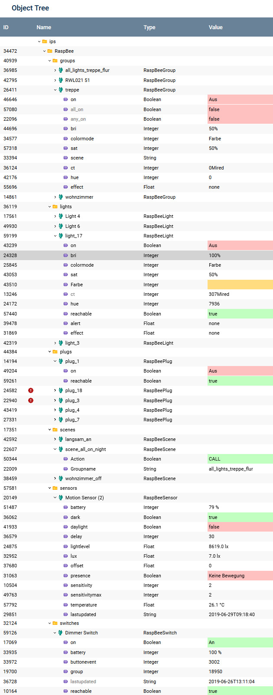
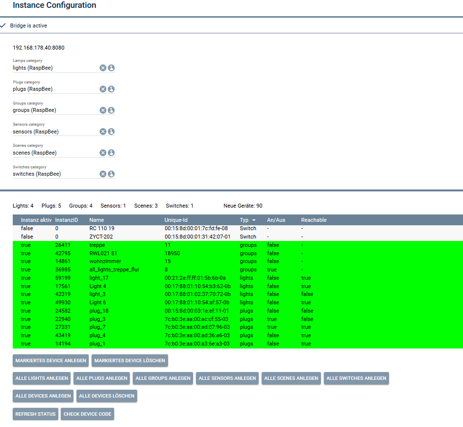
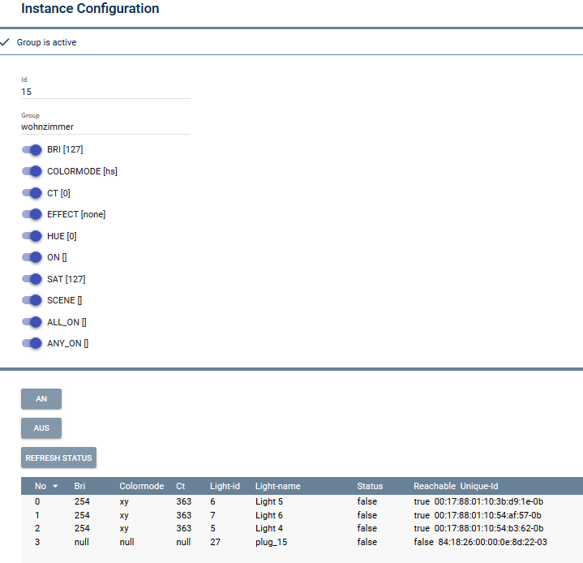
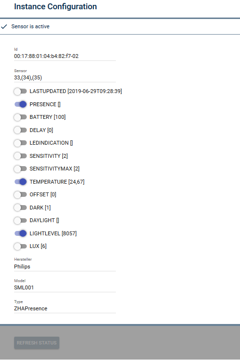
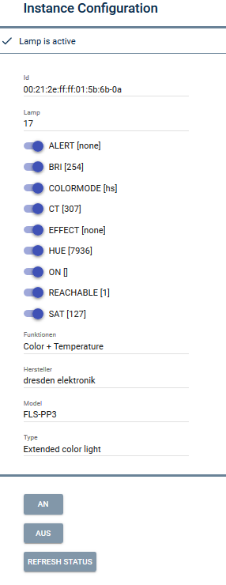

# SymconRaspBee
 

This modul connects the **RaspBee** extension board (for Zigbee Devices) or the **ConBee** usb stick with IP Symcon.

It enables you to work with most ZigBee devices without the need of other specific bridges. 

One of the main advantages (and one of the reasons to write this modul...) is that there is no frequent "pull" of the current status of the devices. This will keep the system performance untouched by frequent requests to the bridge, although nothing changed in the meantime. Status will be updated in real time (very important eg. for presence sensors) as soon as and only if something changes in the status of the devices. This is done of course only for the specific attribute of the changed device. This keeps also the write activity to the system storage as low as posasible (SD cards...)

Supported functionality:

- control lights (eg. on/off, color, hue, sat, alarm, loops, effect, reachable etc.)
- control plugs (eg. on/off, consumption, current, voltage, power, alert, reachable etc.)
- sensors (eg. lightlevel, lux, presence, delay, duration, temperature, battery, fire, carbonmonoxide, vibration etc.)
- switches/remotes (eg. on/off, buttonevent etc.)
- groups (eg. anyon, all_on, effect, scene & all light attributes etc.)
- scenes (eg. on/off, state)
- timers (set on-timer or off-timer for all devices)

Functionality depends on the availability within the specific devices.

 

So, you need
- IP Symcon
- RaspBee extension board (for Raspberry) or a ConBee usb Stick
- some ZigBee devices (eg. Osram, Hue, Xiaomi, Heiman and lots of others
- this modul :wink: of course

 

   Overview on currently supported devices: https://github.com/dresden-elektronik/deconz-rest-plugin/wiki/Supported-Devices

 

# Please read  first

 

 
 

    

    

    

    

    

